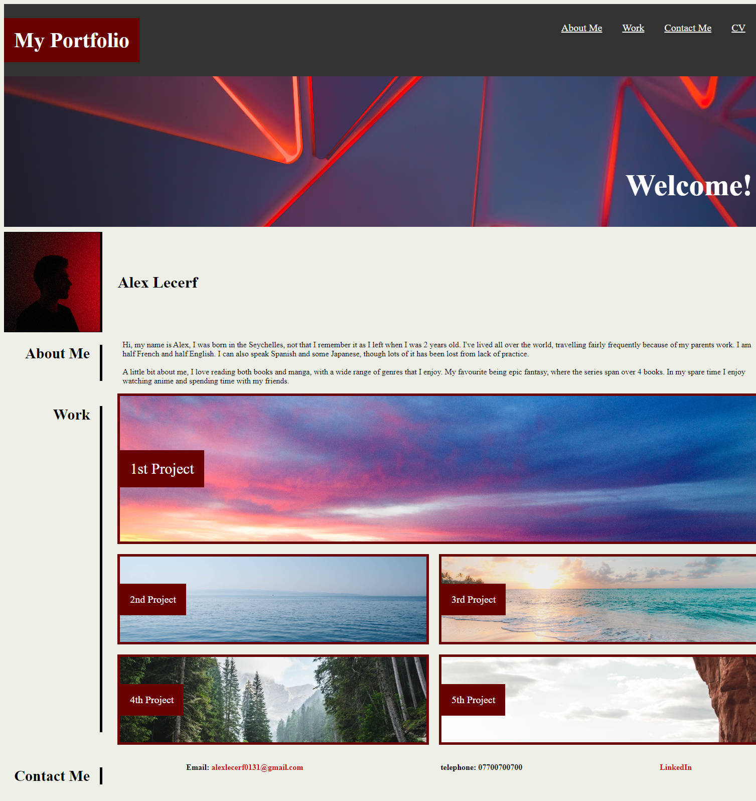
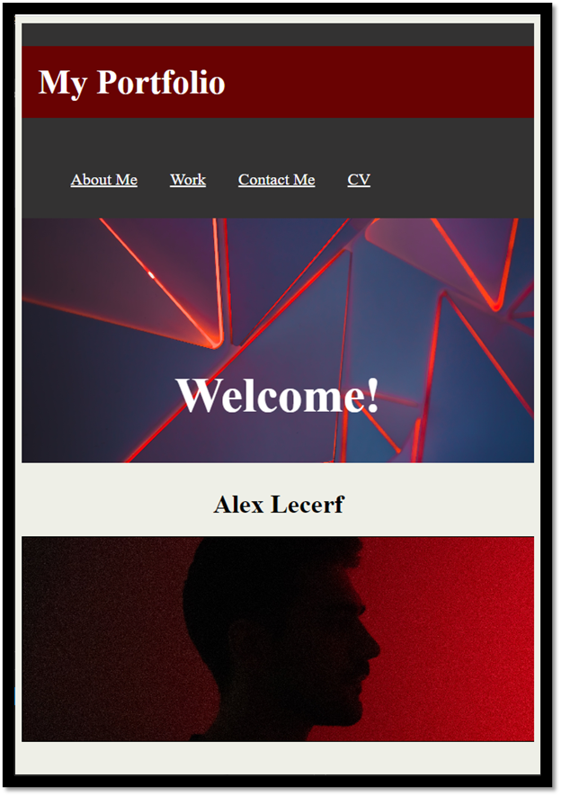

# My-Portfolio

## Description

I have made an application to store my current and all my future projects. This is an effort to create a portfolio which will help me in the future showcase my code and how it's been implemented in the deployed applications.

This will showcase my best works eventually, however currently will only hold one project that has been completed and the others will just be placeholders.

This application showcases what I've learnt so far in using html semantic elements alongside css styling with flex and grid to achieve the desired results.

## Usage

This site holds links to my deployed projects only one of which has been completed so far. You can use the links at the top of the page to smoothly scroll to the relevant sections on the page.

Press each project to link to the deployed application relating to it.

### Project Page

**Below is the attached link for the deployed application**

Click [here](https://alecerf01.github.io/My-Portfolio/) to go to my page.

### Mock-Up

The following image shows the web application's appearance and functionality on a desktop:

The following image shows the web application's appearance and functionality on a mobile device:

Alongside this you have my contact information at the bottom to contact me.

## License

License is displayed in the repo.